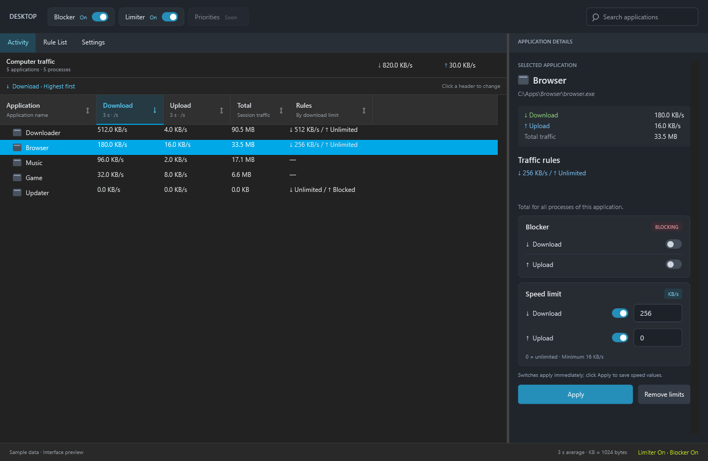
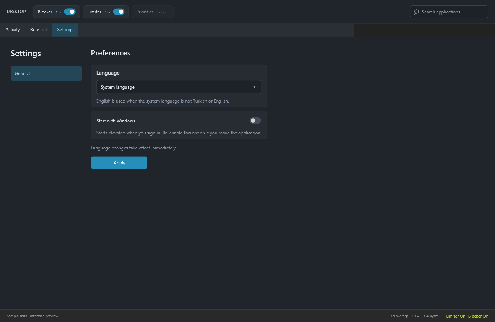

# Limiter

[](https://github.com/emi-ran/Limiter/actions/workflows/windows.yml)

[Türkçe](README.tr.md) · **English**

Monitor, limit and block network traffic by application or process (PID) on Windows. A prototype with a dark interface inspired by NetLimiter, built with C# / .NET 8, WPF and WinDivert.



*Images are rendered from the current WPF interface using sample data; they are not live traffic measurements. This document describes the current source code. Older Release packages may not include every feature.*

## Getting started

Requires Windows x64, [.NET 8 Desktop Runtime](https://dotnet.microsoft.com/download/dotnet/8.0) and administrator privileges.

1. Extract a Windows x64 ZIP from [Releases](https://github.com/emi-ran/Limiter/releases). For newer builds, download the `Limiter-win-x64` artifact from a successful [Actions](https://github.com/emi-ran/Limiter/actions) run.
2. Close any existing Limiter window, run `Limiter.exe` and approve the administrator prompt. The WinDivert driver requires elevation.
3. Generate network traffic in an application, select it in the list, enter download / upload limits in **KB/s**, and click **Apply**.

`0` means unlimited; the minimum positive limit is `16 KB/s`. Keep `WinDivert.dll` and `WinDivert64.sys` alongside the executable.

## Traffic and rules

- **Activity:** Live download / upload rates, session totals, application search and selected application details. Click a column header to toggle ascending / descending sorting; the active column and direction are highlighted. Download rate is sorted highest first by default. The Rules column sorts by the saved download limit.
- **Applications and PIDs:** Processes sharing an executable path are grouped. Expand a row to see individual processes. Application limits apply to combined traffic; PID limits apply to one process. Both can apply together.
- **Speed limits:** Download and upload limits are independent. Direction switches take effect immediately without clearing the saved value; new values are saved with **Apply**.
- **Blocker:** Block download and upload independently. Blocking takes precedence over limits and removes affected queued packets. Application blocking also applies to its child PID rows.
- **Global switches:** Limiter and Blocker pause their respective rules while monitoring continues and saved rules are retained. Both switches reset to enabled when Limiter starts. **Priorities** is not available yet.
- **Rule list:** View saved rules. **Remove limits** clears speed limits only; use the direction switches to remove blocks.

Application rules are stored in `%LOCALAPPDATA%\Limiter\rules.json`. PID rules are not persisted and expire when the process or Limiter exits. Only processes with matched connections appear; session totals for exited processes are retained.

Rates show an approximate **3-second average** of successfully forwarded packets. Network headers and retransmissions are included, so rates may differ from file transfer speeds. `KB = 1024 bytes`. `—` means no saved limit or blocking rule.

## Settings



The **Settings** tab currently offers:

| Option | Behavior |
| --- | --- |
| Language | **System language** is the default. Turkish and English are supported; other system languages fall back to English. You can explicitly select Türkçe or English. **Apply** saves the preference and changes the interface immediately. |
| Start with Windows | Off by default. The switch takes effect immediately and opens Limiter with administrator privileges when the current user signs in. |

The language preference is stored in `%LOCALAPPDATA%\Limiter\settings.json`. Startup uses a per-user Task Scheduler entry named `Limiter.Startup.<SID>`; no password is stored. Turning it off deletes only that entry. If you move the application, turn the option off and on again to update its path.

Startup opens the application window; it is not a separate Windows service. Accounts without the required administrator privileges cannot create the startup entry. If saving or startup registration fails, the selection is rolled back and an error is shown.

## Build from source

On Windows with the [.NET 8 SDK](https://dotnet.microsoft.com/download/dotnet/8.0):

```powershell
git clone https://github.com/emi-ran/Limiter.git
cd Limiter
dotnet build Limiter/Limiter.csproj -c Release
dotnet publish Limiter/Limiter.csproj -c Release -r win-x64 --self-contained false -o dist
```

Run `dist\Limiter.exe`. This package requires the .NET Desktop Runtime.

## Checks

```powershell
dotnet run --project Limiter.EngineChecks/Limiter.EngineChecks.csproj -c Release
```

Checks packet parsing, real Windows TCP connection matching, scheduling, language selection and settings persistence. It does not start the WinDivert capture driver.

For the optional live UDP blocking test, close Limiter and run from an administrator terminal:

```powershell
dotnet run --project Limiter.EngineChecks/Limiter.EngineChecks.csproj -c Release -- --live-blocker
```

This test blocks only its own test process, uses a temporary rules file, and sends `example.com` queries to the `1.1.1.1` DNS server. Real TCP load, IPv6, desktop interaction and long-running transfers require separate verification.

## Known limitations

- Traffic control works only while Limiter is running. There is no separate Windows service.
- TCP, UDP, IPv4 and basic IPv6 are supported. Existing UDP connections may not be matched to a process.
- IPv6 extension headers, fragmented packets and loopback traffic are outside the limiting / blocking scope. Blocking covers only TCP / UDP traffic matched to a process.
- Packets are dropped when queues fill. TCP retransmits; UDP data can be lost. Low limits and multiple connections can cause fluctuating transfer rates.

## CI and releases

[Windows CI](https://github.com/emi-ran/Limiter/actions/workflows/windows.yml) builds in Release mode and runs engine checks on `main` pushes, pull requests and manual runs. It uploads a Windows x64 ZIP containing both READMEs and their images as the `Limiter-win-x64` artifact, retained for 14 days. The live blocking test is not run in CI.

**GitHub Releases are published only when a version tag is pushed** (for example, `v0.14` or `v0.14.1`). A regular `main` push does not create a Release. Write English release notes in `docs/releases/<tag>.md` and commit them before tagging. Missing or empty notes fail the tagged build. After checks pass, the ZIP and those release notes are published. See [v0.14 release notes](docs/releases/v0.14.md). Example for a new version:

```powershell
git tag v0.14
git push origin v0.14
```

Replace the tag with the version you intend to publish; these commands are documentation examples.

## Project layout

| Path | Contents |
| --- | --- |
| `Limiter/` | WPF interface, traffic engine, rules, settings, language resources and Windows startup registration |
| `Limiter.EngineChecks/` | Engine checks and optional live UDP test |
| `docs/images/` | Interface previews rendered with sample data |
| `vendor/WinDivert-2.2.2-A/` | Native WinDivert components and license |
| `.github/workflows/windows.yml` | Windows build, checks, packaging and tagged Releases |

## License

Copyright (C) 2026 emi-ran. Limiter is licensed under the [GNU General Public License v3.0](LICENSE), with the attribution preservation term in [NOTICE](NOTICE) under GPLv3 section 7(b).

When distributing copies or modified versions, preserve applicable copyright and license notices, identify modifications and their dates, and provide corresponding source code to recipients under the GPL's terms. Private modifications that are not distributed do not have to be published.

Distributed forks must preserve the attribution to emi-ran and the original [Limiter project](https://github.com/emi-ran/Limiter). Include the notice from `NOTICE` in your source and accompanying binary legal documentation; a README, NOTICE file or equivalent legal document can carry it. This does not imply endorsement by the original author. Distribution packages must include `LICENSE` and the applicable attribution notice.

WinDivert 2.2.2 is a third-party component distributed under LGPLv3 or GPLv2. See the full [WinDivert license](https://github.com/emi-ran/Limiter/blob/main/vendor/WinDivert-2.2.2-A/LICENSE). The ZIP also includes `WinDivert-LICENSE.txt`.
