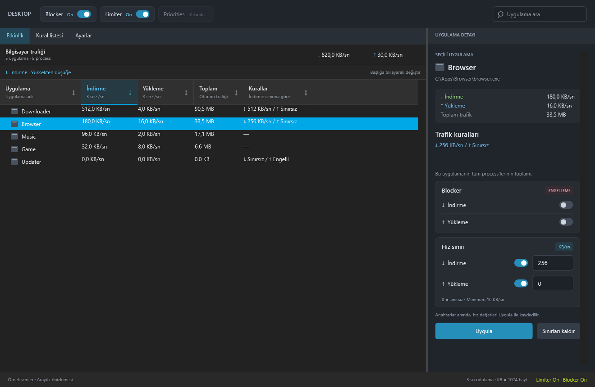

# Limiter

[](https://github.com/emi-ran/Limiter/actions/workflows/windows.yml)

**Türkçe** · [English](README.md)

Windows için uygulama ve process (PID) bazında ağ trafiği izleme, hız sınırlama ve engelleme. NetLimiter'dan esinlenen koyu arayüz; C# / .NET 8, WPF ve WinDivert ile geliştirilen bir prototip.



*Görseller güncel WPF arayüzünden örnek verilerle oluşturulmuştur; canlı trafik ölçümü değildir. Bu belge kaynak kodun güncel durumunu anlatır; eski Release paketleri bütün özellikleri içermeyebilir.*

## Başlangıç

Windows x64, [.NET 8 Desktop Runtime](https://dotnet.microsoft.com/download/dotnet/8.0) ve yönetici yetkisi gerekir.

1. [Releases](https://github.com/emi-ran/Limiter/releases) bölümündeki Windows x64 ZIP paketini bir klasöre çıkarın. Daha güncel derlemeler için [Actions](https://github.com/emi-ran/Limiter/actions) içindeki başarılı çalışmanın `Limiter-win-x64` artifact paketini kullanabilirsiniz.
2. Açık Limiter penceresi varsa kapatın, `Limiter.exe` dosyasını çalıştırın ve yönetici iznini onaylayın. WinDivert sürücüsü bu yetkiyi gerektirir.
3. Bir uygulamada ağ trafiği başlatın ve listeden uygulamayı seçin. İndirme / yükleme sınırını **KB/sn** olarak girip **Uygula** düğmesine basın.

`0` sınırsızdır; en küçük pozitif sınır `16 KB/sn` olur. `WinDivert.dll` ve `WinDivert64.sys` dosyalarını çalıştırılabilir dosyanın yanında tutun.

## Trafik ve kurallar

- **Etkinlik:** Canlı indirme / yükleme hızları, oturum toplamı, uygulama araması ve seçili uygulama ayrıntıları. Başlıklara tıklayarak artan / azalan sıralayın; aktif sütun ve sıralama yönü vurgulanır. Başlangıçta en yüksek indirme hızı üsttedir. Kurallar sütunu kayıtlı indirme sınırına göre sıralanır.
- **Uygulama ve PID:** Aynı dosya yolundaki process'ler gruplanır. Satırı okla genişleterek process'leri görün. Uygulama sınırı toplam trafiğe, PID sınırı yalnızca o process'e uygulanır; ikisi birlikte çalışabilir.
- **Hız sınırı:** İndirme ve yükleme ayrı ayarlanır. Yön anahtarları sınırı değerini silmeden hemen açıp kapatır; yeni hız değerleri **Uygula** ile kaydedilir.
- **Blocker:** İndirme ve yüklemeyi ayrı engeller. Engelleme hız sınırından önce uygulanır ve ilgili bekleyen paketleri kuyruktan çıkarır. Uygulama engeli alt PID'leri de kapsar.
- **Üst anahtarlar:** Limiter ve Blocker kuralları topluca duraklatır; trafik izleme sürer ve kurallar korunur. Bu iki anahtar oturumluk olup her açılışta etkin başlar. **Priorities** henüz kullanıma açık değildir.
- **Kural listesi:** Kayıtlı kuralları görüntüler. **Sınırları kaldır** yalnızca hız sınırlarını temizler; engeller yön anahtarlarından kaldırılır.

Uygulama kuralları `%LOCALAPPDATA%\Limiter\rules.json` içinde saklanır. PID kuralları kalıcı değildir; process veya Limiter kapanınca sona erer. Yalnızca bağlantısı eşleşen process'ler listelenir; kapanan process'lerin oturum toplamları korunur.

Hızlar başarıyla iletilen paketlerin yaklaşık **3 saniyelik ortalamasıdır**. Ağ başlıkları ve yeniden gönderimler dahildir; dosya indirme hızından farklı olabilir. `KB = 1024 bayt`. `—`, kayıtlı sınır veya engelleme kuralı olmadığını belirtir.

## Ayarlar


**Ayarlar / Settings** sekmesinde iki seçenek bulunur:

| Seçenek | Davranış |
| --- | --- |
| Dil | **Sistem dili** varsayılandır. Türkçe ve İngilizce desteklenir; diğer sistem dillerinde İngilizce kullanılır. Açıkça Türkçe veya English seçilebilir. **Uygula**, seçimi kaydeder ve dili yeniden başlatmadan değiştirir. |
| Windows ile başlat | Varsayılan kapalıdır. Anahtar hemen uygulanır; mevcut kullanıcı oturum açtığında Limiter penceresini yönetici yetkisiyle açar. |

Dil tercihi `%LOCALAPPDATA%\Limiter\settings.json` içinde saklanır. Başlangıç için kullanıcıya özel `Limiter.Startup.<SID>` Görev Zamanlayıcı kaydı kullanılır; parola saklanmaz. Kapatınca yalnızca bu kayıt silinir. Uygulamayı başka klasöre taşırsanız seçeneği kapatıp yeniden açın.

Başlangıç seçeneği ayrı bir Windows servisi değildir. Yönetici olmayan hesaplarda gerekli yetki olmadan kayıt oluşturulamaz. Kaydetme veya başlangıç kaydı başarısız olduğunda seçim geri alınır ve hata gösterilir.

## Kaynak koddan derleme

[.NET 8 SDK](https://dotnet.microsoft.com/download/dotnet/8.0) kurulu bir Windows makinesinde:

```powershell
git clone https://github.com/emi-ran/Limiter.git
cd Limiter
dotnet build Limiter/Limiter.csproj -c Release
dotnet publish Limiter/Limiter.csproj -c Release -r win-x64 --self-contained false -o dist
```

`dist\Limiter.exe` dosyasını çalıştırın. Bu paket .NET Desktop Runtime gerektirir.

## Kontroller

```powershell
dotnet run --project Limiter.EngineChecks/Limiter.EngineChecks.csproj -c Release
```

Paket ayrıştırma, gerçek Windows TCP bağlantı eşleştirmesi, zamanlama, dil seçimi ve ayar saklama kontrollerini çalıştırır; WinDivert yakalama sürücüsünü başlatmaz.

İsteğe bağlı canlı UDP engelleme testi için Limiter'ı kapatın ve yönetici terminalinde çalıştırın:

```powershell
dotnet run --project Limiter.EngineChecks/Limiter.EngineChecks.csproj -c Release -- --live-blocker
```

Bu kontrol yalnızca kendi test process'ini engeller, geçici kural dosyası kullanır ve `1.1.1.1` DNS sunucusuna `example.com` sorguları gönderir. Gerçek TCP yükü, IPv6, masaüstü etkileşimi ve uzun süreli aktarım ayrıca doğrulanmalıdır.

## Bilinen sınırlar

- Limiter yalnızca uygulama açıkken çalışır; ayrı Windows servisi yoktur.
- TCP, UDP, IPv4 ve temel IPv6 desteklenir. Önceden kurulmuş UDP bağlantıları process ile eşleşmeyebilir.
- IPv6 uzantı başlıkları, parçalanmış paketler ve loopback trafiği limit / engelleme kapsamının dışındadır. Engelleme yalnızca süreçle eşleşen TCP / UDP trafiğini kapsar.
- Kuyruk dolduğunda paketler düşürülür. TCP yeniden gönderir; UDP verisi kaybolabilir. Özellikle düşük sınırlar ve çoklu bağlantılarda hız dalgalanabilir.

## CI ve sürümler

[Windows CI](https://github.com/emi-ran/Limiter/actions/workflows/windows.yml), `main` push'larında, pull request'lerde ve elle başlatıldığında Release derlemesi ve çekirdek kontrollerini çalıştırır. Windows x64 ZIP paketi, iki README ve görsellerle birlikte `Limiter-win-x64` artifact'ına yüklenir; 14 gün saklanır. Canlı engelleme testi CI'da çalışmaz.

**GitHub Release yalnızca sürüm etiketi push edildiğinde yayınlanır** (örneğin `v0.14` veya `v0.14.1`). Normal `main` push'u Release oluşturmaz. Etiketlemeden önce İngilizce sürüm notlarını `docs/releases/<etiket>.md` dosyasına yazıp commit edin. Notlar yoksa veya boşsa etiketli derleme başarısız olur. Kontroller geçtikten sonra ZIP ve bu sürüm notları yayınlanır. [v0.14 sürüm notları](docs/releases/v0.14.md). Yeni sürüm için örnek:

```powershell
git tag v0.14
git push origin v0.14
```

Etiketi yayınlayacağınız sürüm numarasıyla değiştirin; bu komutlar belge örneğidir.

## Proje yapısı

| Yol | İçerik |
| --- | --- |
| `Limiter/` | WPF arayüzü, trafik motoru, kurallar, ayarlar, dil kaynakları ve Windows başlangıç kaydı |
| `Limiter.EngineChecks/` | Çekirdek kontrolleri ve isteğe bağlı canlı UDP testi |
| `docs/images/` | Örnek verilerle oluşturulmuş arayüz görselleri |
| `vendor/WinDivert-2.2.2-A/` | WinDivert yerel bileşenleri ve lisansı |
| `.github/workflows/windows.yml` | Windows derleme, kontrol, paketleme ve etiketli Release |

## Lisans

Copyright (C) 2026 emi-ran. Limiter, [GNU Genel Kamu Lisansı v3.0 (GPLv3)](LICENSE) ve GPLv3 bölüm 7(b) kapsamında [NOTICE](NOTICE) dosyasındaki atfı koruma koşuluyla lisanslanmıştır.

Kopyaları veya değiştirilmiş sürümleri dağıtırken geçerli telif ve lisans bildirimlerini korumalı, değişiklikleri ve tarihlerini belirtmeli, ilgili kaynak kodunu GPL koşulları kapsamında alıcılara sağlamalısınız. Dağıtılmayan özel değişiklikleri yayımlama zorunluluğu yoktur.

Dağıtılan fork'lar emi-ran'a ve özgün [Limiter projesine](https://github.com/emi-ran/Limiter) atfı korumalıdır. `NOTICE` içindeki bildirimi kaynak kodla ve ikili dağıtımlara eşlik eden hukuki belgelerle birlikte sunun; README, NOTICE veya eşdeğer bir hukuki belge kullanılabilir. Atıf, özgün yazarın fork'u onayladığı anlamına gelmez. Dağıtım paketleri `LICENSE` ve geçerli atıf bildirimini içermelidir.

WinDivert 2.2.2, LGPLv3 veya GPLv2 seçenekleriyle dağıtılan bir üçüncü taraf bileşendir. Tam metin: [WinDivert lisansı](https://github.com/emi-ran/Limiter/blob/main/vendor/WinDivert-2.2.2-A/LICENSE). ZIP paketinde ayrıca `WinDivert-LICENSE.txt` bulunur.
